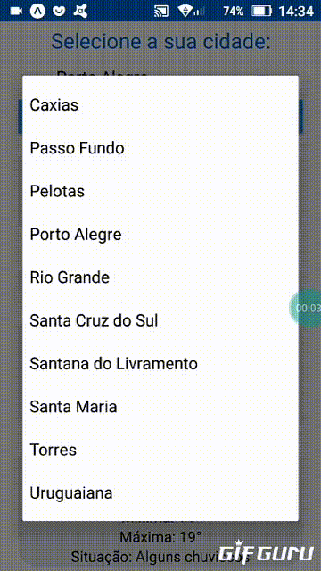

# previsaodotempo
Website desenvolvido utilizando HTML, CSS, Bootsprap 4 e JavaScript, acessível em: https://mateuscardoso99.github.io/previsaodotempo
API de previsão do tempo utilizada: https://hgbrasil.com/status/weather, 
no plano gratuito são permitidas no máximo 2500 requisições por dia e no máximo 10 cidades diferentes

o aplicativo foi desenvolvido com React Native e abaixo uma mostragem do app em execução:

